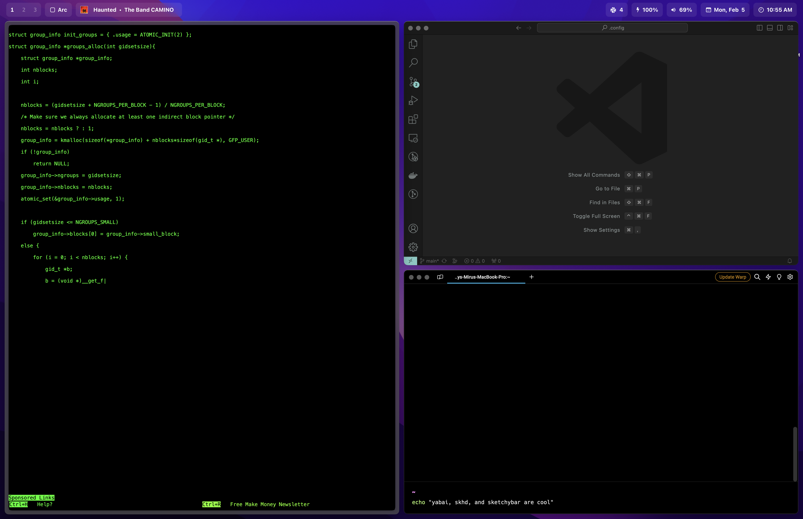

# dotfiles

dotfiles for my personal macOS setup

add these folders to `~/.config/`



## sketchybar

[view on GitHub](https://github.com/FelixKratz/SketchyBar)

**Install**

```
brew tap FelixKratz/formulae
brew install sketchybar
brew install switchaudio-osx
```

**Start/Restart/Stop**

```
brew services start sketchybar
brew services restart sketchybar
brew services stop sketchybar
```

**Dev**

For verbose output:

```
sketchybar
```

## yabai

[view on GitHub](https://github.com/koekeishiya/yabai)

**Install**

```
brew install koekeishiya/formulae/yabai
```

**Start/Restart/Stop**

```
yabai --start-service
yabai --restart-service
yabai --stop-service
```

**Update to latest**

```
brew updtade yabai
```

## JankyBorders

[view on GitHub](https://github.com/FelixKratz/JankyBorders)

bootstrapped with yabai

**Install**¥

```
brew tap FelixKratz/formulae
brew install borders
```

## skhd

[view on Github](https://github.com/koekeishiya/skhd)

**Install**

```
brew install koekeishiya/formulae/skhd
```

**Start/Restart/Stop**

```
skhd --start-service
skhd --restart-service
skhd --stop-service
```

**Configured Hotkeys**

Window Directions:

- `h` - ⬅️
- `j` - ⬇️
- `k` - ⬆️
- `l` - ➡️

Display Directions:

- `u` - ⬅️
- `i` - ⬇️
- `o` - ⬆️
- `p` - ➡️

Space Directions:

- `n` - ⬅️
- `m` - ➡️

Operations (combine with directions):

- `alt` - focus
- `shift + alt` - move
- `shift + ctrl` - move and split
- `ctrl + alt` - resize

For all commands, see [skhd/skhdrc](./skhd/skhdrc)
